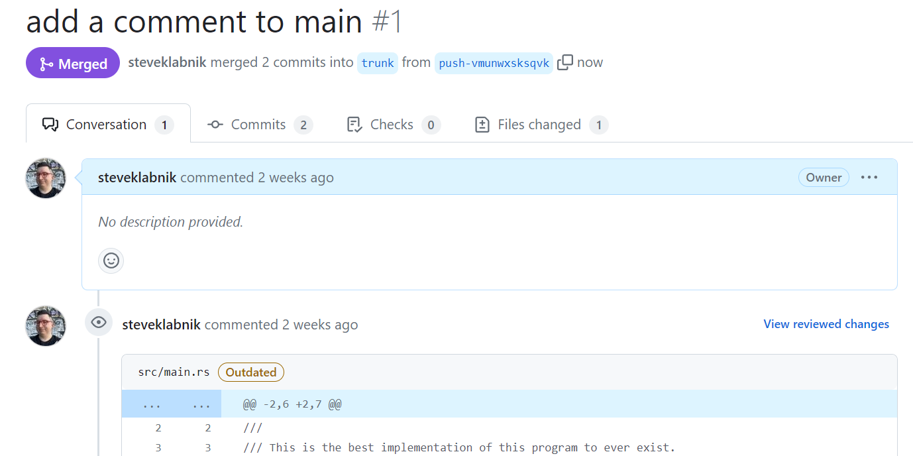

# Working on all of your branches simultaneously

I think this is one of the first things I saw about `jj` that made me go "wait,
WHAT?!?" I was asking questions on the `jj` Discord, and one of the developers,
[Austin], mentioned that

> Also. I can rebase all my branches simultaneously too.

This section is going to explain what he meant by that, and how he uses `jj` to
manage multiple pull requests at the same time.

First, we'll do some set up to have a few pull requests going on at the same
time. Then we'll show you how you can develop against all of them simultaneously,
and when your upstream updates, you can rebase them all simultanously.

[Austin]: https://github.com/thoughtpolice

## The set up

Let's check out our example project to make sure we're on the same place:

```console
> jj log
@  msmntwvo steve@steveklabnik.com 2024-03-02 11:47:08.000 -06:00 push-vmunwxsksqvk 752534be
│  add a new function
◉  vmunwxsk steve@steveklabnik.com 2024-03-02 11:47:08.000 -06:00 f6f7dce9
│  add a comment to main
◉  ksrmwuon steve@steveklabnik.com 2024-03-01 23:10:35.000 -06:00 trunk e202b67c
│  Update Cargo.toml
```

Right! We have an outstanding pull request from a previous section. If you have
made some of your own changes, maybe do this next section an extra time, so that
you have enough outstanding branches. Austin's original example had five, so
that's how many I'm going to make. If you want to make fewer, two works too, or
you can go a little harder and make even more branches. Up to you!

Let's make some more branches! We want to start them all from `trunk`, not on each
other:

```console
> jj new trunk
Working copy now at: opwqpunl 7ede4eb9 (empty) (no description set)
Parent commit      : ksrmwuon e202b67c trunk | Update Cargo.toml
Added 0 files, modified 1 files, removed 0 files
~/Documents/GitHub/sample-jj-project/hello-world> jj log
@  opwqpunl steve@steveklabnik.com 2024-03-17 14:12:52.000 -05:00 7ede4eb9
│  (empty) (no description set)
│ ◉  msmntwvo steve@steveklabnik.com 2024-03-02 11:47:08.000 -06:00 push-vmunwxsksqvk 752534be
│ │  add a new function
│ ◉  vmunwxsk steve@steveklabnik.com 2024-03-02 11:47:08.000 -06:00 f6f7dce9
├─╯  add a comment to main
◉  ksrmwuon steve@steveklabnik.com 2024-03-01 23:10:35.000 -06:00 trunk e202b67c
│  Update Cargo.toml
~
```

We've now started a new branch from `trunk`. Let's give it a description, add
a second commit with its own description, and then make a pull request out of
it. Feel free to make changes in the code in here if you'd like, it doesn't
matter for our purposes.

```console
> jj describe -m "display the birthday date on the settings page"
Working copy now at: opwqpunl 1a66beb1 (empty) display the birthday date on the settings page
Parent commit      : ksrmwuon e202b67c trunk | Update Cargo.toml
> jj new -m "have galactus query eks with time range"
Working copy now at: yxxppztp 3d123151 (empty) have galactus query eks with time range
Parent commit      : opwqpunl 1a66beb1 (empty) display the birthday date on the settings page
> jj git push -c @
Creating branch push-yxxppztpoyqq for revision @
Branch changes to push to origin:
  Add branch push-yxxppztpoyqq to 3d1231518dbf
> jj log
@  yxxppztp steve@steveklabnik.com 2024-03-17 14:18:00.000 -05:00 push-yxxppztpoyqq 3d123151
│  (empty) have galactus query eks with time range
◉  opwqpunl steve@steveklabnik.com 2024-03-17 14:15:58.000 -05:00 1a66beb1
│  (empty) display the birthday date on the settings page
│ ◉  msmntwvo steve@steveklabnik.com 2024-03-02 11:47:08.000 -06:00 push-vmunwxsksqvk 752534be
│ │  add a new function
│ ◉  vmunwxsk steve@steveklabnik.com 2024-03-02 11:47:08.000 -06:00 f6f7dce9
├─╯  add a comment to main
◉  ksrmwuon steve@steveklabnik.com 2024-03-01 23:10:35.000 -06:00 trunk e202b67c
│  Update Cargo.toml
~
```

Great! We have two pull requests. Do this again at least once, but maybe two or
three times. It's cooler with more branches, trust me.

```console
> jj new trunk -m "prepare to deploy to the cloud"
Working copy now at: tmnmvxyy 105cf6b5 (empty) prepare to deploy to the cloud
Parent commit      : ksrmwuon e202b67c trunk | Update Cargo.toml
> jj new -m "various fixes"
Working copy now at: rxpztwms 902a6cd2 (empty) various fixes
Parent commit      : tmnmvxyy 105cf6b5 (empty) prepare to deploy to the cloud
> jj git push -c @
Creating branch push-rxpztwmsszvk for revision @
Branch changes to push to origin:
  Add branch push-rxpztwmsszvk to 902a6cd22f30
```

Your `jj log` will look like this:

```console
> jj log
@  ymvptyyq steve@steveklabnik.com 2024-03-17 14:25:31.000 -05:00 push-ymvptyyqmyul 728dbb1e
│  (empty) fixing all the breakage from updating dependencies
◉  xulymzyp steve@steveklabnik.com 2024-03-17 14:25:14.000 -05:00 1f7c69a5
│  (empty) updating dependencies
│ ◉  zxyukunn steve@steveklabnik.com 2024-03-17 14:24:56.000 -05:00 push-zxyukunnwolo 30081a6b
│ │  (empty) first 80% done
│ ◉  tzsloruo steve@steveklabnik.com 2024-03-17 14:24:21.000 -05:00 7c02f6ce
├─╯  (empty) another feature
│ ◉  rxpztwms steve@steveklabnik.com 2024-03-17 14:23:00.000 -05:00 push-rxpztwmsszvk 902a6cd2
│ │  (empty) various fixes
│ ◉  tmnmvxyy steve@steveklabnik.com 2024-03-17 14:22:15.000 -05:00 105cf6b5
├─╯  (empty) prepare to deploy to the cloud
│ ◉  yxxppztp steve@steveklabnik.com 2024-03-17 14:18:00.000 -05:00 push-yxxppztpoyqq 3d123151
│ │  (empty) have galactus query eks with time range
│ ◉  opwqpunl steve@steveklabnik.com 2024-03-17 14:15:58.000 -05:00 1a66beb1
├─╯  (empty) display the birthday date on the settings page
│ ◉  msmntwvo steve@steveklabnik.com 2024-03-02 11:47:08.000 -06:00 push-vmunwxsksqvk 752534be
│ │  add a new function
│ ◉  vmunwxsk steve@steveklabnik.com 2024-03-02 11:47:08.000 -06:00 f6f7dce9
├─╯  add a comment to main
◉  ksrmwuon steve@steveklabnik.com 2024-03-01 23:10:35.000 -06:00 trunk e202b67c
│  Update Cargo.toml
```

That's a lot of branches!

We could do what we do with `git`, and just work on each branch individually.
But we can do more interesting things than that: let's work on every branch
at the same time.

## Working on every branch

So, here's how we can work on every branch at the same time: we create a merge
with the parents of *every* branch we have. My command looks like this, but
you'll have to use the appropriate change IDs for what your repository looks
like. I'm also using the short form of each name, which helps when you have five
of them! Anyway:

```console
> jj new ym z r yx m -m "merge: steve's branch"
Working copy now at: xnutwmso 695806ff (empty) merge: steve's branch
Parent commit      : ymvptyyq 728dbb1e push-ymvptyyqmyul | (empty) fixing all the breakage from updating dependencies
Parent commit      : zxyukunn 30081a6b push-zxyukunnwolo | (empty) first 80% done
Parent commit      : rxpztwms 902a6cd2 push-rxpztwmsszvk | (empty) various fixes
Parent commit      : yxxppztp 3d123151 push-yxxppztpoyqq | (empty) have galactus query eks with time range
Parent commit      : msmntwvo 752534be push-vmunwxsksqvk | add a new function
Added 0 files, modified 1 files, removed 0 files
```

Whew! What a change! Five parents. Let's create an extra one so we can use our
squash-style workflow more easily: we temporarily work on a `@` change, and then
`jj squash` diffs back into whichever parent makes the most sense.

```console
> jj new
Working copy now at: nllzosqm 85324040 (empty) (no description set)
Parent commit      : xnutwmso 695806ff (empty) merge: steve's branch
```

Check out this `jj log`:

```console
> jj log
@  nllzosqm steve@steveklabnik.com 2024-03-17 14:36:36.000 -05:00 85324040
│  (empty) (no description set)
◉          xnutwmso steve@steveklabnik.com 2024-03-17 14:30:52.000 -05:00 695806ff
├─┬─┬─┬─╮  (empty) merge: steve's branch
│ │ │ │ ◉  msmntwvo steve@steveklabnik.com 2024-03-02 11:47:08.000 -06:00 push-vmunwxsksqvk 752534be
│ │ │ │ │  add a new function
│ │ │ │ ◉  vmunwxsk steve@steveklabnik.com 2024-03-02 11:47:08.000 -06:00 f6f7dce9
│ │ │ │ │  add a comment to main
│ │ │ ◉ │  yxxppztp steve@steveklabnik.com 2024-03-17 14:18:00.000 -05:00 push-yxxppztpoyqq 3d123151
│ │ │ │ │  (empty) have galactus query eks with time range
│ │ │ ◉ │  opwqpunl steve@steveklabnik.com 2024-03-17 14:15:58.000 -05:00 1a66beb1
│ │ │ ├─╯  (empty) display the birthday date on the settings page
│ │ ◉ │  rxpztwms steve@steveklabnik.com 2024-03-17 14:23:00.000 -05:00 push-rxpztwmsszvk 902a6cd2
│ │ │ │  (empty) various fixes
│ │ ◉ │  tmnmvxyy steve@steveklabnik.com 2024-03-17 14:22:15.000 -05:00 105cf6b5
│ │ ├─╯  (empty) prepare to deploy to the cloud
│ ◉ │  zxyukunn steve@steveklabnik.com 2024-03-17 14:24:56.000 -05:00 push-zxyukunnwolo 30081a6b
│ │ │  (empty) first 80% done
│ ◉ │  tzsloruo steve@steveklabnik.com 2024-03-17 14:24:21.000 -05:00 7c02f6ce
│ ├─╯  (empty) another feature
◉ │  ymvptyyq steve@steveklabnik.com 2024-03-17 14:25:31.000 -05:00 push-ymvptyyqmyul 728dbb1e
│ │  (empty) fixing all the breakage from updating dependencies
◉ │  xulymzyp steve@steveklabnik.com 2024-03-17 14:25:14.000 -05:00 1f7c69a5
├─╯  (empty) updating dependencies
◉  ksrmwuon steve@steveklabnik.com 2024-03-01 23:10:35.000 -06:00 trunk e202b67c
│  Update Cargo.toml
```

Glorious!

So now our working directory has all of our changes in it. We can make changes,
and then `jj squash` them into the appropriate branch. If we decide we want a
new change at the head of any of these branches, we'll need to use a rebase,
but it's not too bad:

```console
> jj new z -m "second 80% done"
Working copy now at: kvupxvpv 2ea49586 (empty) second 80% done
Parent commit      : zxyukunn 30081a6b push-zxyukunnwolo | (empty) first 80% done
Added 0 files, modified 1 files, removed 0 files
> jj log
    @  kvupxvpv steve@steveklabnik.com 2024-03-17 14:43:28.000 -05:00 46cb6847
    | (empty) second 80% done
  ◉ |      xnutwmso steve@steveklabnik.com 2024-03-17 14:30:52.000 -05:00 695806ff
╭─┼─┬─┬─╮  (empty) merge: steve's branch
◉ │ │ │ │  msmntwvo steve@steveklabnik.com 2024-03-02 11:47:08.000 -06:00 push-vmunwxsksqvk 752534be
│ │ │ │ │  add a new function
◉ │ │ │ │  vmunwxsk steve@steveklabnik.com 2024-03-02 11:47:08.000 -06:00 f6f7dce9
│ │ │ │ │  add a comment to main
│ │ │ │ ◉  yxxppztp steve@steveklabnik.com 2024-03-17 14:18:00.000 -05:00 push-yxxppztpoyqq 3d123151
│ │ │ │ │  (empty) have galactus query eks with time range
│ │ │ │ ◉  opwqpunl steve@steveklabnik.com 2024-03-17 14:15:58.000 -05:00 1a66beb1
├───────╯  (empty) display the birthday date on the settings page
│ │ │ ◉  rxpztwms steve@steveklabnik.com 2024-03-17 14:23:00.000 -05:00 push-rxpztwmsszvk 902a6cd2
│ │ │ │  (empty) various fixes
│ │ │ ◉  tmnmvxyy steve@steveklabnik.com 2024-03-17 14:22:15.000 -05:00 105cf6b5
├─────╯  (empty) prepare to deploy to the cloud
│ │ ◉  zxyukunn steve@steveklabnik.com 2024-03-17 14:24:56.000 -05:00 push-zxyukunnwolo 30081a6b
│ │ │  (empty) first 80% done
│ │ ◉  tzsloruo steve@steveklabnik.com 2024-03-17 14:24:21.000 -05:00 7c02f6ce
├───╯  (empty) another feature
│ ◉  ymvptyyq steve@steveklabnik.com 2024-03-17 14:25:31.000 -05:00 push-ymvptyyqmyul 728dbb1e
│ │  (empty) fixing all the breakage from updating dependencies
│ ◉  xulymzyp steve@steveklabnik.com 2024-03-17 14:25:14.000 -05:00 1f7c69a5
├─╯  (empty) updating dependencies
◉  ksrmwuon steve@steveklabnik.com 2024-03-01 23:10:35.000 -06:00 trunk e202b67c
│  Update Cargo.toml
```

Yikes! Don't worry, we can fix that with a rebase: 

```console
> jj rebase -r xn -d m -d ym -d yx -d r -d kv
```

We want to rebase the revision `xn` with the following "destination" revisions:
`m`, `ym`, `yx`, `r`, and `kv`. Since we have multiple parents, that's what will
happen:

```console
> jj log
◉          xnutwmso steve@steveklabnik.com 2024-03-17 15:16:36.000 -05:00 da67dfe1
├─┬─┬─┬─╮  (empty) merge: steve's branch
│ │ │ │ @  kvupxvpv steve@steveklabnik.com 2024-03-17 15:15:20.000 -05:00 2ea49586
│ │ │ │ │  (empty) second 80% done
│ │ │ │ ◉  zxyukunn steve@steveklabnik.com 2024-03-17 14:24:56.000 -05:00 push-zxyukunnwolo 30081a6b
│ │ │ │ │  (empty) first 80% done
│ │ │ │ ◉  tzsloruo steve@steveklabnik.com 2024-03-17 14:24:21.000 -05:00 7c02f6ce
│ │ │ │ │  (empty) another feature
│ │ │ ◉ │  rxpztwms steve@steveklabnik.com 2024-03-17 14:23:00.000 -05:00 push-rxpztwmsszvk 902a6cd2
│ │ │ │ │  (empty) various fixes
│ │ │ ◉ │  tmnmvxyy steve@steveklabnik.com 2024-03-17 14:22:15.000 -05:00 105cf6b5
│ │ │ ├─╯  (empty) prepare to deploy to the cloud
│ │ ◉ │  yxxppztp steve@steveklabnik.com 2024-03-17 14:18:00.000 -05:00 push-yxxppztpoyqq 3d123151
│ │ │ │  (empty) have galactus query eks with time range
<snip>
~
```

We're back to our beautiful tree, though our `@` working commit got lost in the
shuffle. It was empty anyway! Let's bring it back:

```console
> jj new xn
Working copy now at: pptrunzw 06442487 (empty) (no description set)
Parent commit      : xnutwmso bcf8a74b (empty) merge: steve's branch
Added 0 files, modified 2 files, removed 0 files
> jj log
@  pptrunzw steve@steveklabnik.com 2024-03-17 14:55:59.000 -05:00 06442487
│  (empty) (no description set)
◉          xnutwmso steve@steveklabnik.com 2024-03-17 14:52:08.000 -05:00 bcf8a74b
├─┬─┬─┬─╮  (empty) merge: steve's branch

<snip>
```

Excellent.

## Rebasing on upstream changes

What happens when some changes land upstream, and we need to rebase our pull
requests. If you're like me, you often have multiple PRs going at any given
time. Rebasing them all can be very tedius. Here's how we can do that
with this workflow.

First, let's make a change upstream. I'm going to do this by merging [my open
PR] from earlier in the tutorial:



After fetching changes, our log looks like this:

```console
> jj git fetch
> jj log
@  xqkmpxlq steve@steveklabnik.com 2024-03-17 15:18:11.000 -05:00 fccf0626
│  (empty) (no description set)
◉          xnutwmso steve@steveklabnik.com 2024-03-17 15:16:36.000 -05:00 da67dfe1
├─┬─┬─┬─╮  (empty) merge: steve's branch
│ │ │ │ ◉  kvupxvpv steve@steveklabnik.com 2024-03-17 15:15:20.000 -05:00 2ea49586
│ │ │ │ │  (empty) second 80% done
│ │ │ │ ◉  zxyukunn steve@steveklabnik.com 2024-03-17 14:24:56.000 -05:00 push-zxyukunnwolo 30081a6b
│ │ │ │ │  (empty) first 80% done
│ │ │ │ ◉  tzsloruo steve@steveklabnik.com 2024-03-17 14:24:21.000 -05:00 7c02f6ce
│ │ │ │ │  (empty) another feature
│ │ │ ◉ │  rxpztwms steve@steveklabnik.com 2024-03-17 14:23:00.000 -05:00 push-rxpztwmsszvk 902a6cd2
│ │ │ │ │  (empty) various fixes
│ │ │ ◉ │  tmnmvxyy steve@steveklabnik.com 2024-03-17 14:22:15.000 -05:00 105cf6b5
│ │ │ ├─╯  (empty) prepare to deploy to the cloud
│ │ ◉ │  yxxppztp steve@steveklabnik.com 2024-03-17 14:18:00.000 -05:00 push-yxxppztpoyqq 3d123151
│ │ │ │  (empty) have galactus query eks with time range
│ │ ◉ │  opwqpunl steve@steveklabnik.com 2024-03-17 14:15:58.000 -05:00 1a66beb1
│ │ ├─╯  (empty) display the birthday date on the settings page
│ ◉ │  ymvptyyq steve@steveklabnik.com 2024-03-17 14:25:31.000 -05:00 push-ymvptyyqmyul 728dbb1e
│ │ │  (empty) fixing all the breakage from updating dependencies
│ ◉ │  xulymzyp steve@steveklabnik.com 2024-03-17 14:25:14.000 -05:00 1f7c69a5
│ ├─╯  (empty) updating dependencies
◉ │  msmntwvo?? steve@steveklabnik.com 2024-03-17 14:45:41.000 -05:00 push-vmunwxsksqvk* cdca9211
│ │  add a new function
◉ │  vmunwxsk?? steve@steveklabnik.com 2024-03-17 14:45:41.000 -05:00 3a08be8a
├─╯  add a comment to main
│ ◉  okyzuxnk steve@steveklabnik.com 2024-03-17 14:59:02.000 -05:00 trunk b7f9d708
╭─╯  (empty) Merge pull request #1 from steveklabnik/push-vmunwxsksqvk
◉  ksrmwuon steve@steveklabnik.com 2024-03-01 23:10:35.000 -06:00 e202b67c
│  Update Cargo.toml
~
```

Uh oh! That's got some concerning stuff. The changes with `??` and are in red,
and there's also the new merge commit that `trunk` is set up to. Since all of
our branches were off of the change where `trunk` used to be, we should rebase
them on top of the new trunk.  First, we want to make sure that `@` is at the
empty change on top of our merge commit. You can see from the `jj log` just
above that that is true.

We can rebase all of our PRs with one command:

```console
> jj rebase -s 'all:roots(trunk..@)' -d trunk
Rebased 14 commits
Working copy now at: ltupzukw 9a496ef6 (empty) (no description set)
Parent commit      : xnutwmso 6be25a32 (empty) merge: steve's branch
```

This is using some revset stuff we haven't seen before! Let's break it down:

This is using `jj rebase -s` rather than `-r`, like we've been doing before. Here's
the description from `jj rebase --help`:

```text
  -s, --source <SOURCE>
          Rebase specified revision(s) together their tree of descendants (can be repeated)
```

That's a little rough. There are some helpful diagrams in `jj rebase --help` that
got me to understand the differences between `-r`, `-s`, and `-b`, but the short
of it is that `-r` will sort of "rip out" a change and move it somewhere else.
`-s` does that, but also moves desendants. In other words, imagine that we have
a history like this:

```text
A - B - C - D 
```

If we `jj rebase -r C` to somewhere else, it will only move that revision, and so
you end up with

```text
A - B - D
```

Whereas `-s` operates more like I'd be used to with `git`: it takes the children
too, so after `jj rebase -s B`, you'd have:

```text
A - B
```

as both `C` and `D` are somewhere else now. `-b` works to rebase a branch.

The next part, `all:' is a prefix. What's the prefix do? Well, let's try running
the command without it:

```console
> jj rebase -s 'roots(trunk..@)' -d trunk
Error: Revset "roots(trunk..@)" resolved to more than one revision
Hint: The revset "roots(trunk..@)" resolved to these revisions:
opwqpunl ba100a96 (empty) display the birthday date on the settings page
tmnmvxyy 462dcf72 (empty) prepare to deploy to the cloud
tzsloruo fdba6abd (empty) another feature
xulymzyp abbf424e (empty) updating dependencies
vmunwxsk?? 2ce46bd0 (empty) add a comment to main
Prefix the expression with 'all' to allow any number of revisions (i.e. 'all:roots(trunk..@)').
```

This is basically a way to help make sure you've got the right arguments: sometimes
when working with revsets, you expect the result to be only one revision, and
sometimes you expect it to be many revisions. For some commands, one or the
other may be not neccesarily what you want. In this case, most of the time,
when you rebase, you only want one parent. So if we use a revset that returns
more than one change, that might be a bug! So `jj rebase` wants us to reassure
that we are creating a change with multiple parents by putting `all:` as a
prefix.

Finally, `trunk..@` is being passed to the `roots()` function. `trunk..@` is
a range, so it will give every change between where `trunk` is and `@`. The
`roots()` function gives back the roots of the changes provided to it, so in
this case, commits that have children but no parents. To which you may say,
"but don't those commits have parents?" In general, sure, but because we are
only returning the set of those commits, their parents aren't in the set, and
therefore don't exist for the purposes of a function like this. This means we
end up with the commits that have `trunk` as parents, and have children
themselves. The roots of the tree.

Let's put it all together:

```console
$ jj rebase -s 'all:roots(trunk..@)' -d trunk
```

> We're rebasing all of the root changes from `trunk` to `@` onto `trunk`.

Kind of a mouthful, but not too bad to understand!

Here's what our `jj log` looks like:

```console
> jj log
◉  xnutwmso steve@steveklabnik.com 2024-03-17 16:01:56.000 -05:00 ce833ae7
│  (empty) merge: steve's branch
◉          xqkmpxlq steve@steveklabnik.com 2024-03-17 16:01:56.000 -05:00 5dc292c2
├─┬─┬─┬─╮  (empty) (no description set)
│ │ │ │ │ @  ltupzukw steve@steveklabnik.com 2024-03-17 16:01:56.000 -05:00 edf9cd58
╭─┬─┬─┬─┬─╯  (empty) (no description set)
│ │ │ │ ◉  yxxppztp steve@steveklabnik.com 2024-03-17 16:01:56.000 -05:00 push-yxxppztpoyqq* b3db74d3
│ │ │ │ │  (empty) have galactus query eks with time range
│ │ │ │ ◉  opwqpunl steve@steveklabnik.com 2024-03-17 16:01:56.000 -05:00 713c692d
│ │ │ │ │  (empty) display the birthday date on the settings page
│ │ │ ◉ │  rxpztwms steve@steveklabnik.com 2024-03-17 16:01:56.000 -05:00 push-rxpztwmsszvk* 76dbbcd1
│ │ │ │ │  (empty) various fixes
│ │ │ ◉ │  tmnmvxyy steve@steveklabnik.com 2024-03-17 16:01:56.000 -05:00 d0f7f627
│ │ │ ├─╯  (empty) prepare to deploy to the cloud
│ │ ◉ │  ymvptyyq steve@steveklabnik.com 2024-03-17 16:01:56.000 -05:00 push-ymvptyyqmyul* f448e93a
│ │ │ │  (empty) fixing all the breakage from updating dependencies
│ │ ◉ │  xulymzyp steve@steveklabnik.com 2024-03-17 16:01:56.000 -05:00 d608ebd3
│ │ ├─╯  (empty) updating dependencies
│ ◉ │  msmntwvo?? steve@steveklabnik.com 2024-03-17 16:01:56.000 -05:00 push-vmunwxsksqvk* 21569f7a
│ │ │  (empty) add a new function
│ ◉ │  vmunwxsk?? steve@steveklabnik.com 2024-03-17 16:01:56.000 -05:00 9a050939
│ ├─╯  (empty) add a comment to main
◉ │  kvupxvpv steve@steveklabnik.com 2024-03-17 16:01:56.000 -05:00 3b0a722a
│ │  (empty) second 80% done
◉ │  zxyukunn steve@steveklabnik.com 2024-03-17 16:01:56.000 -05:00 push-zxyukunnwolo* 7e826ad4
│ │  (empty) first 80% done
◉ │  tzsloruo steve@steveklabnik.com 2024-03-17 16:01:56.000 -05:00 792cc601
├─╯  (empty) another feature
◉  okyzuxnk steve@steveklabnik.com 2024-03-17 14:59:02.000 -05:00 trunk b7f9d708
│  (empty) Merge pull request #1 from steveklabnik/push-vmunwxsksqvk
~
```

Let's move `@` back to where we want it:

```console
> jj new xn
Working copy now at: vvvouunp 78919d69 (empty) (no description set)
Parent commit      : xnutwmso ce833ae7 (empty) merge: steve's branch
> jj abandon l
Abandoned commit ltupzukw edf9cd58 (empty) (no description set)
> jj log
@  vvvouunp steve@steveklabnik.com 2024-03-17 16:02:39.000 -05:00 78919d69
│  (empty) (no description set)
◉  xnutwmso steve@steveklabnik.com 2024-03-17 16:01:56.000 -05:00 ce833ae7
│  (empty) merge: steve's branch
◉          xqkmpxlq steve@steveklabnik.com 2024-03-17 16:01:56.000 -05:00 5dc292c2
├─┬─┬─┬─╮  (empty) (no description set)
│ │ │ │ ◉  yxxppztp steve@steveklabnik.com 2024-03-17 16:01:56.000 -05:00 push-yxxppztpoyqq* b3db74d3
│ │ │ │ │  (empty) have galactus query eks with time range
│ │ │ │ ◉  opwqpunl steve@steveklabnik.com 2024-03-17 16:01:56.000 -05:00 713c692d
│ │ │ │ │  (empty) display the birthday date on the settings page
│ │ │ ◉ │  rxpztwms steve@steveklabnik.com 2024-03-17 16:01:56.000 -05:00 push-rxpztwmsszvk* 76dbbcd1
│ │ │ │ │  (empty) various fixes
│ │ │ ◉ │  tmnmvxyy steve@steveklabnik.com 2024-03-17 16:01:56.000 -05:00 d0f7f627
│ │ │ ├─╯  (empty) prepare to deploy to the cloud
│ │ ◉ │  ymvptyyq steve@steveklabnik.com 2024-03-17 16:01:56.000 -05:00 push-ymvptyyqmyul* f448e93a
│ │ │ │  (empty) fixing all the breakage from updating dependencies
│ │ ◉ │  xulymzyp steve@steveklabnik.com 2024-03-17 16:01:56.000 -05:00 d608ebd3
│ │ ├─╯  (empty) updating dependencies
│ ◉ │  msmntwvo?? steve@steveklabnik.com 2024-03-17 16:01:56.000 -05:00 push-vmunwxsksqvk* 21569f7a
│ │ │  (empty) add a new function
│ ◉ │  vmunwxsk?? steve@steveklabnik.com 2024-03-17 16:01:56.000 -05:00 9a050939
│ ├─╯  (empty) add a comment to main
◉ │  kvupxvpv steve@steveklabnik.com 2024-03-17 16:01:56.000 -05:00 3b0a722a
│ │  (empty) second 80% done
◉ │  zxyukunn steve@steveklabnik.com 2024-03-17 16:01:56.000 -05:00 push-zxyukunnwolo* 7e826ad4
│ │  (empty) first 80% done
◉ │  tzsloruo steve@steveklabnik.com 2024-03-17 16:01:56.000 -05:00 792cc601
├─╯  (empty) another feature
◉  okyzuxnk steve@steveklabnik.com 2024-03-17 14:59:02.000 -05:00 trunk b7f9d708
│  (empty) Merge pull request #1 from steveklabnik/push-vmunwxsksqvk
~
```

Looking pretty good! One last thing: what's up with those red commits? Well,
those are from our external PR, and we don't need them. So we can just abandon
that branch:

```console
> jj abandon push-vmunwxsksqvk
Abandoned commit msmntwvo?? 21569f7a push-vmunwxsksqvk* | (empty) add a new function
Rebased 3 descendant commits onto parents of abandoned commits
Working copy now at: vvvouunp ace3f1a2 (empty) (no description set)
Parent commit      : xnutwmso 32871810 (empty) merge: steve's branch
> jj abandon push-vmunwxsksqvk
Abandoned commit vmunwxsk?? 9a050939 push-vmunwxsksqvk* | (empty) add a comment to main
Rebased 3 descendant commits onto parents of abandoned commits
Working copy now at: vvvouunp e3f9254f (empty) (no description set)
Parent commit      : xnutwmso 0459bd1c (empty) merge: steve's branch
```

And now our log is clean:

```text
> jj log
@  vvvouunp steve@steveklabnik.com 2024-03-17 16:06:15.000 -05:00 e3f9254f
│  (empty) (no description set)
◉  xnutwmso steve@steveklabnik.com 2024-03-17 16:06:15.000 -05:00 0459bd1c
│  (empty) merge: steve's branch
◉        xqkmpxlq steve@steveklabnik.com 2024-03-17 16:06:15.000 -05:00 c9e5fa35
├─┬─┬─╮  (empty) (no description set)
│ │ │ ◉  yxxppztp steve@steveklabnik.com 2024-03-17 16:01:56.000 -05:00 push-yxxppztpoyqq* b3db74d3
│ │ │ │  (empty) have galactus query eks with time range
│ │ │ ◉  opwqpunl steve@steveklabnik.com 2024-03-17 16:01:56.000 -05:00 713c692d
│ │ │ │  (empty) display the birthday date on the settings page
│ │ ◉ │  rxpztwms steve@steveklabnik.com 2024-03-17 16:01:56.000 -05:00 push-rxpztwmsszvk* 76dbbcd1
│ │ │ │  (empty) various fixes
│ │ ◉ │  tmnmvxyy steve@steveklabnik.com 2024-03-17 16:01:56.000 -05:00 d0f7f627
│ │ ├─╯  (empty) prepare to deploy to the cloud
│ ◉ │  ymvptyyq steve@steveklabnik.com 2024-03-17 16:01:56.000 -05:00 push-ymvptyyqmyul* f448e93a
│ │ │  (empty) fixing all the breakage from updating dependencies
│ ◉ │  xulymzyp steve@steveklabnik.com 2024-03-17 16:01:56.000 -05:00 d608ebd3
│ ├─╯  (empty) updating dependencies
◉ │  kvupxvpv steve@steveklabnik.com 2024-03-17 16:01:56.000 -05:00 3b0a722a
│ │  (empty) second 80% done
◉ │  zxyukunn steve@steveklabnik.com 2024-03-17 16:01:56.000 -05:00 push-zxyukunnwolo* 7e826ad4
│ │  (empty) first 80% done
◉ │  tzsloruo steve@steveklabnik.com 2024-03-17 16:01:56.000 -05:00 792cc601
├─╯  (empty) another feature
◉  okyzuxnk steve@steveklabnik.com 2024-03-17 14:59:02.000 -05:00 push-vmunwxsksqvk* trunk b7f9d708
│  (empty) Merge pull request #1 from steveklabnik/push-vmunwxsksqvk
~
```

And there we go!

## Conclusion

This workflow may not make sense to you, but it is a very neat example of using
the tools you already know to do something completely different! We're going to
talk about a slightly different workflow next: "stacked pull requests". They're
similar in some ways to this approach, but there's also some differences too.

[my open PR]: https://github.com/steveklabnik/jj-hello-world/pull/1
