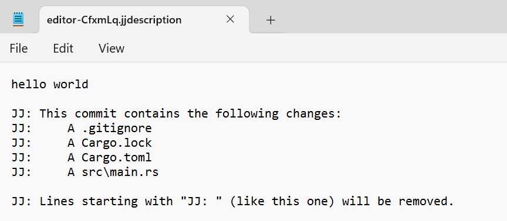

# Using `jj describe` to describe our commits in a human-friendly way

While we can refer to our changes by their change ID or commit ID, that's not
always great. Text is a much better way to describe things for humans.

However, before we can describe commits, we have to let `jj` know who we are.
Let's set some quick configuration:

```console
$ jj config set --user user.name "Steve Klabnik"
$ jj config set --user user.email "steve@steveklabnik.com"
```

Obviously, unless you're me, you should be putting your own name and email in
there. Okay, with that out of the way, we're ready to describe some changes.

Whenever we feel like it, we can describe our changes with `jj describe`.
The simplest way to use it is with the `-m`, or "message" flag. This allows us
to pass the description on the command line:

```console
$ jj describe -m "hello world!"
Working copy now at: yyrsmnoo 524d2bf4 hello world
Parent commit      : zzzzzzzz 00000000 (empty) (no description set)
```

Our message, `hello world`, has replaced the `(no description set)` text. We're
gonna be able to see this whenever we look at our repository history.

For more real changes though, you'll probably want to not use the `-m` flag.
And, since descriptions can be set at any time, we can also change them too.
Let's try it again:

```console
$ jj describe
```

An editor will pop up; I'm on Windows, so I'm getting notepad.



This window shows my original message, "hello world," and then
a bunch of lines that start with `JJ: `. As the final one mentions,
these lines are ignored when forming the commit description. So let's
make a longer description, like this:

```text
hello world

This is an initial "Hello, world!" implementation, nothing fancy.

More fun stuff to come.

JJ: This commit contains the following changes:
JJ:     A .gitignore
JJ:     A Cargo.lock
JJ:     A Cargo.toml
JJ:     A src\main.rs

JJ: Lines starting with "JJ: " (like this one) will be removed.
```

After saving and closing, we'll get this output:

```console
Working copy now at: yyrsmnoo ac691d85 hello world
Parent commit      : zzzzzzzz 00000000 (empty) (no description set)
```

We only see that first line, but the rest are still there.

Eagle eyed readers may notice one other change. Let's take two of these outputs
and put them next to each other:

```text
Working copy now at: yyrsmnoo 524d2bf4 hello world
Working copy now at: yyrsmnoo ac691d85 hello world
```

Changing our description changed the commit ID! This is why we have both IDs:
the change ID has not changed, but the commit ID has. This allows us to evolve
our commit over time, but still have a stable way to refer to all versions of it.

We will come back to this more in the future, because first, I'd like to show
you how to make new changes.
