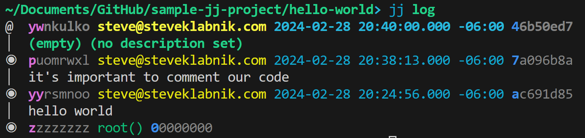

# Viewing the contents of your repository with jj log

Let's look at our chain of changes:

```console
> jj log
@  ywnkulko steve@steveklabnik.com 2024-02-28 20:40:00.000 -06:00 46b50ed7
│  (empty) (no description set)
◉  puomrwxl steve@steveklabnik.com 2024-02-28 20:38:13.000 -06:00 7a096b8a
│  it's important to comment our code
◉  yyrsmnoo steve@steveklabnik.com 2024-02-28 20:24:56.000 -06:00 ac691d85
│  hello world
◉  zzzzzzzz root() 00000000
```

As you can see, this is sort of like `git log`, but also very different. There's
a bunch going on here, let's talk about various parts of this.

The very first character at the top left is an `@`. `@` is a special name for
"whichever commit the working copy reflects." At first I kind of thought about it
like `HEAD` in `git`, but that's not correct: `HEAD` is the most recent commit,
but `@` represents the working copy, which may be "dirty" from `git`'s point
of view. This is our first glimpse into the power of the index-less workflow,
though we'll explore that fully in the next chapter. For this moment, just
realize that we have one less concept, but haven't actually lost any of its
power.

Next, we see the change ID. On the far right, we see the commit ID. This is
because when viewing things this way, we almost certainly don't care about the
commit ID: we care about the sequence of stable change identifiers. Between
the two is the author and the time, and on the line below, we have our
description.

At the bottom, we have our root commit, but instead of an author and a time,
it says `root()`. This is a *revset*, which is a feature we'll explore later.
But the short of it is this: `jj` has a really powerful way to select lists
of revisions. `root()` is a function in this language (yes, it has functions)
that returns the root commit.

One more thing: my text representation of the output of `jj log` was missing
something. Here's a screenshot of my terminal, and you may notice something
interesting:



The output has color, and a lot of it! But the most important bit is the
highlights in the revision IDs and commit IDs. See how `yw` is in magenta,
but the rest of the ID is in grey, `nkulko`? Similar to `git`, when talking
about an ID, you only need to refer to the unique prefix, and not the whole ID.
So that magenta bit is showing you said prefix; we could run commands that
refer to `ywnkulko` or `yw` and they'd both work. Why is it two characters? Well,
because we also have `yyrsmnoo`. But see how the middle change, `p` is the
prefix and `uomrwxl` is in grey? Because this is the only change that starts with
`p`. But since we have two changes starting with `y`, we need a second character
to make them unique.

It's very cool that the UI is communicating this to us! And, it's also why the
format of change IDs is pretty cool: by using letters, there are less likely to
be conflicts, which means these are very often very short, until your repository
grows pretty large.

There are many more secrets to `jj log`, but for now, this is enough to be
able to go back and look at all of your changes, so we're gonna keep it
there. Let's recap what we've learned.
