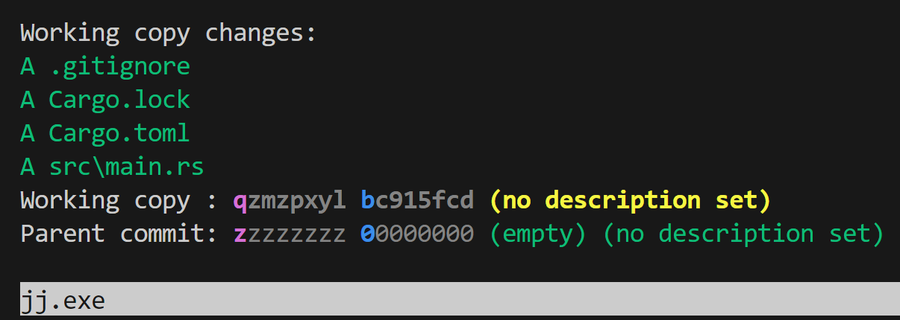

# Viewing the current status with `jj st`

We can view the status of our repository with `jj st`. Let's run that now:

```console
$ jj st
```



This is the `jj` "pager", a program that shows the output of commands, and lets
you scroll through them if they get really long. You can hit `q` to get back to
your console.

You can request to not use the pager by using `jj st --no-pager`, or if you hate
the pager and want to turn it off, you can configure that with

```console
$ jj config set --user ui.paginate never
```

I am going to present the examples in the book as if this is the configuration,
because managing text is easier than wrangling screenshots. The same information
ends up on the screen no matter which way you prefer. Speaking of, let's actually
talk about the output of `jj st`:

```console
$ jj st --no-pager
Working copy changes:
A .gitignore
A Cargo.lock
A Cargo.toml
A src\main.rs
Working copy : qzmzpxyl bc915fcd (no description set)
Parent commit: zzzzzzzz 00000000 (empty) (no description set)
```

There's a surprising amount of stuff to talk about here! Let's dig into it.

```text
Working copy changes:
A .gitignore
A Cargo.lock
A Cargo.toml
A src\main.rs
```

This is the first thing we need to talk about: unlike `git`, `jj` has no index.
Wait, don't close the tab! Here's the thing: `jj` gives you the same ability to
craft artisanal, beautiful commits that have exactly what you want in them. But
it doesn't need an index to do it.

This is a running theme with `jj`: it gives you fewer tools, but those tools end
up having equivalent or even more power than their `git` counterparts. Because
there are fewer tools, there's also less to learn. Now I am not one of those
"the `git` CLI is too complex and `git` is too hard to learn" people, but I do
acknowledge that puts me in the minority. But let's reframe that: if we can
make something more powerful *and* easier? Sign me up!

We'll get into how to reproduce the power of an index later. For now, what we
need to know is that every time you run a `jj` command, it examines the working
copy (the files on disk) and takes a snapshot. So here, it's noticed that we've
`A`dded some new files. You'll also see `M`odified files, and `D`eleted files.

```text
Working copy : qzmzpxyl bc915fcd (no description set)
Parent commit: zzzzzzzz 00000000 (empty) (no description set)
```

Our brand new repo shows that we have two *changes*. You'll notice that the
text on the second one says "commit" there, and... yeah okay so: `jj` has a few
different concepts here. The first is a commit. Our two commits have the
identifiers `bc915fcd` and `00000000`. But there's also the idea of a "change,"
and that's that in `jj`, commits can evolve over time. But we still need a
stable identifier to talk about those changes, so we have a "change ID," and
that's `qzmzpxyl` and `zzzzzzzz`. One really cool thing is that they use a
disjoint set of identifiers: `qzmzpxyl` can never be a commit ID, but must be
a change ID, and `bc914fcd` can never be a change ID, but must be a commit ID.
This is surprisingly handy.

Anyway, we'll talk more about commits and changes soon, and how they're
different, but first we should talk about the rest of the details here. The
first part is that each repository always has a `zzzzzzzz 00000000` change, and
it's always empty. This is called the "root commit" and it is the foundation of
the whole repository. Given that it's empty, `jj` has created a second change
based on top of it, in this case, `qzmzpxyl` and it is tracking the contents of
the working copy. Since it's not empty, its line here doesn't have the `(empty)`
bit like our root change has.

Finally, both of our changes say `(no description set)`, and that's because we
haven't given them a description yet! We'll talk about descriptions in the next
section.
