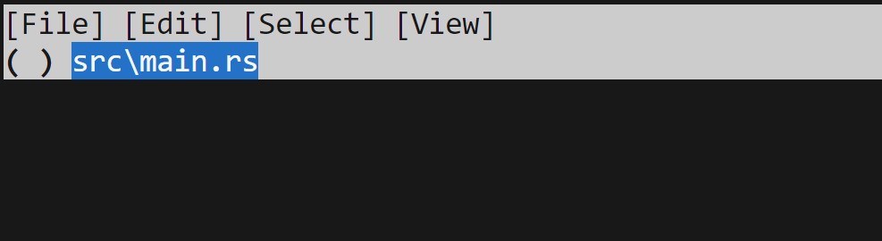
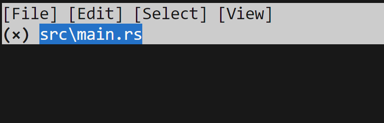
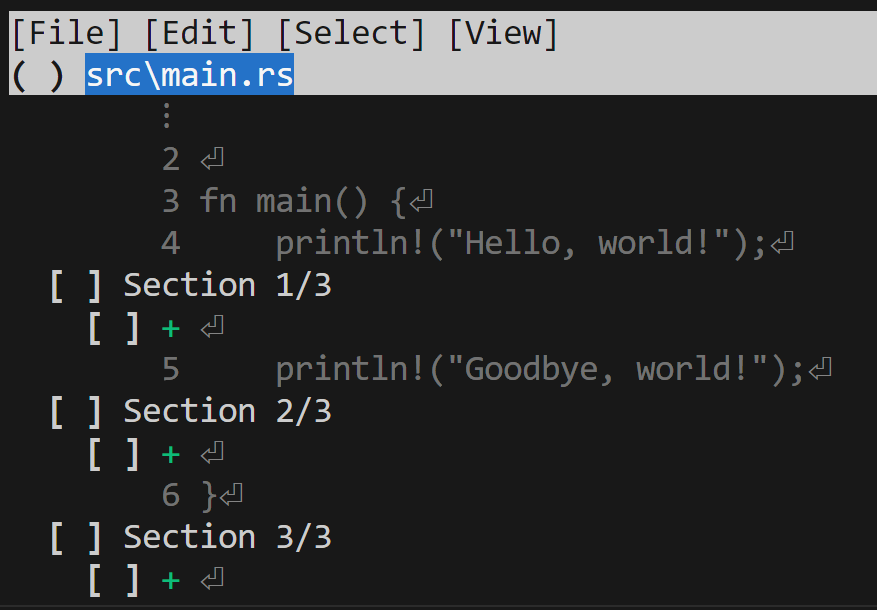

# The Squash Workflow

The first workflow we're going to talk about is the "squash workflow," the one
preferred by `jj`'s creator, Martin. It's called "the squash workflow" because
it uses a command we haven't interacted with yet, `jj squash`. The second reason
that I'm talking about this workflow first is that it is the workflow that
should appeal to people who are big fans of `git`'s index, and I think comparing
and contrasting the two is interesting.

The workflow goes like this:

1. We describe the work we want to do.
2. We create a new empty change on top of that one.
3. As we produce work we want to put into our change, we use `jj squash` to move
   changes from `@` into the change where we described what to do.

In some senses, this workflow is like using the `git` index, where we have our
list of current changes (in `@`), and we pull the ones we want into our commit
(like `git add`).

## Starting work by describing it

Let's recap where we are in our project: `@` currently is an empty commit:

```console
> jj log
@  ywnkulko steve@steveklabnik.com 2024-02-28 20:40:00.000 -06:00 46b50ed7
│  (empty) (no description set)
◉  puomrwxl steve@steveklabnik.com 2024-02-28 20:38:13.000 -06:00 7a096b8a
│  it's important to comment our code
◉  yyrsmnoo steve@steveklabnik.com 2024-02-28 20:24:56.000 -06:00 ac691d85
│  hello world
◉  zzzzzzzz root() 00000000
```

Let's describe the work that we want to do:

```console
$ jj describe -m "print goodbye as well as hello"
Working copy now at: ywnkulko 4bfe3940 (empty) print goodbye as well as hello
Parent commit      : puomrwxl 7a096b8a it's important to comment our code
```

This change is currently empty, but we've now given it a useful name. This
is the change we're going to build up over time. But for now, it's empty.

## Create a new empty change

We need a place to hold our changes until we decide if we want to put them in
our commit or not. So let's make a new one:

```console
$ jj new
Working copy now at: rkvxolny 5e020e00 (empty) (no description set)
Parent commit      : ywnkulko 4bfe3940 (empty) print goodbye as well as hello
```

We now have our change. It's also empty! There's no issue having two empty
commits, one after the other. And since we are using this like an index, we
dont really need to give it a name either. It's just a scratch space, but 
since it's part of a change, we're "always committed" in a sense.

Now it's time for the fun stuff.

## Use `jj squash` to move things into our "real" change

Let's make a change to our code:

```rust
/// A "Hello, world!" program.

fn main() {
    println!("Hello, world!");
    println!("Goodbye, world!");
}
```

Now that our "feature" has been implemented, let's see our current changes:

```console
$ jj st
Working copy changes:
M src\main.rs
Working copy : rkvxolny aee5266d (no description set)
Parent commit: ywnkulko 4bfe3940 (empty) print goodbye as well as hello
```

We now have an even wilder situation than before: our current change has stuff
in it, but the parent is empty! Let's change that. We want to take our change
from our "staging area" and put it into our commit (change). We can do that with
`jj squash`:

```console
$ jj squash
Working copy now at: oopolqyp 9fb63b14 (empty) (no description set)
Parent commit      : ywnkulko ed71bb54 print goodbye as well as hello
```

Lots of changes here! `@` is now empty, with no description, and the parent is
now no longer empty. Our changes are now in `ywnkulko`.

What we did is kind of the equivalent of `git commit -a --amend`. But what about more
focused changes? Well, if we only want to add a specific file, like `git add
<file> && git commit --amend` we can pass it as an argument. Because we only had
one file, the previous command was equivalent to

```console
$ jj squash src/main.rs
```

But we can also get the equivalent of `git add -p && git commit --amend`, where
we only add parts of a file to our commit. And it's gonna blow your mind.

Make a few changes around your source file, and then do this:

```console
$ jj squash -i
```

This will bring up a TUI!



By default, it's showing a file-level view: we have our one file, and the `( )` indicates that
we haven't selected to include this. We could do so by hitting space, and that
will fill the parenthesis in with an x:



Let's press space again to undo that, and then hit `f` to toggle "folding":



I added empty spaces in a few places, and you can see each individual section
and line has its own checkbox. We can use the mouse to click, or arrow keys to
navigate, and space to toggle if we're accepting these changes.

Once we're done, we can hit `c` to confirm our changes. I'm not selecting any,
since these were just nonsense stuff I wanted to add to show off the TUI. I
dont want to keep them at all, so let's just dump them. We can get rid of
the stuff in `@` with `jj abandon`:

```console
$ jj abandon
Abandoned commit oopolqyp 44665581 (no description set)
Working copy now at: ootnlvpt 97b7a559 (empty) (no description set)
Parent commit      : ywnkulko ed71bb54 print goodbye as well as hello
Added 0 files, modified 1 files, removed 0 files
```

We've thrown away `oopolqyp`, and `jj` has helpfully made a new empty change
for us. 

This is the kind of stuff I mean when I say "the same power, but less concepts."
We've got the tools that the index gave us, but they're simpler because we don't
use some of them on the index, and some on commits: we use them all on commits.

That also implies that "the same power" isn't exactly true: `jj squash` is
more powerful than `git add` because it can work on *any* change and its parent,
moving stuff between them. This gets into the kind of shenanigans you can get
up to with `git rebase -i`, without the need for *another* command like that.
Simpler, but *more* powerful, thanks to orthogonality.

## Recap and thoughts

This workflow is not super different than our previous one, but by adding one
more command, we get a bit more power. And we've learned that we can use
`jj squash` to move contents of changes into their parent.
