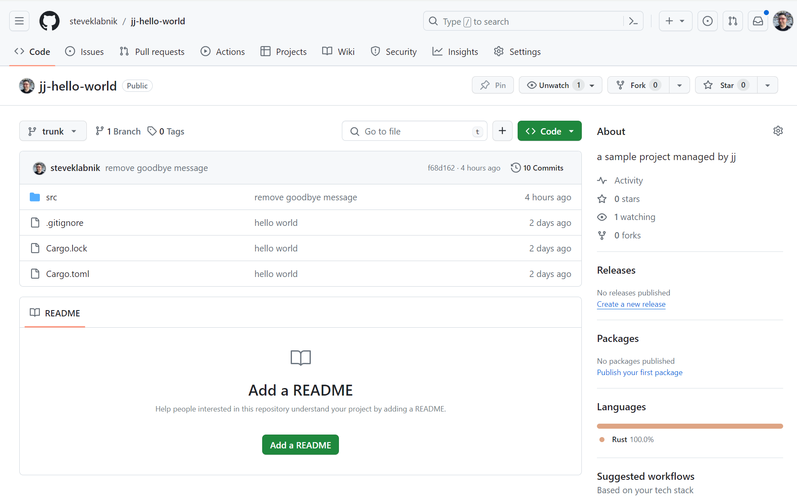
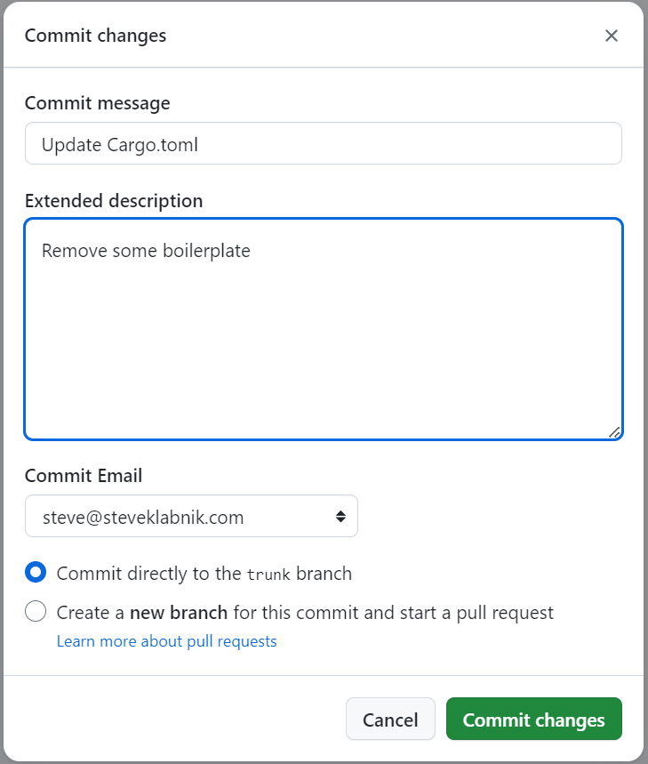
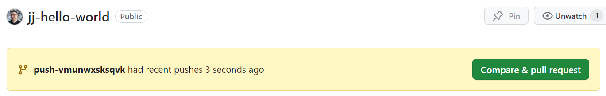

# Working with remotes, e.g., GitHub

We're going to talk about working with remote `git` servers, and using GitHub as
an example. The same principles apply to any given `git` server, though.

## Pushing our code to GitHub

The first thing to do is to create the remote server. I have made a GitHub
project at [https://github.com/steveklabnik/jj-hello-world][gh]. I'm adding it
as an upstream like this:

```console
> jj git remote add origin git@github.com:steveklabnik/jj-hello-world.git
```

Before we push our commit up, we need to fix our repository:

```console
$ jj log --limit 2
@  pzkrzopz steve@steveklabnik.com 2024-03-01 22:41:37.000 -06:00 trunk fcf669c5
│  (empty) (no description set)
◉  povouosx steve@steveklabnik.com 2024-03-01 18:12:43.000 -06:00 f68d1623
│  remove goodbye message
```

Let's swap `@` back to the previous change, and then abandon this one. We can
do that like this:

```console
$ jj edit @-
Working copy now at: povouosx f68d1623 remove goodbye message
Parent commit      : vvmrvwuz d41c079b refactor printing
$ jj bookmark set trunk --allow-backwards
Moved 1 bookmarks to povouosx f68d1623 | remove goodbye message
$ jj abandon pzkrzopz
Abandoned commit pzkrzopz fcf669c5 (empty) (no description set)
$ jj log --limit 2
@  povouosx steve@steveklabnik.com 2024-03-01 18:12:43.000 -06:00 trunk f68d1623
│  remove goodbye message
◉  vvmrvwuz steve@steveklabnik.com 2024-03-01 17:49:07.000 -06:00 d41c079b
│  refactor printing
```

We need the `--allow-backwards` flag to set the `trunk` branch to the previous
commit because it is a dangerous operation: if we had pushed `trunk`, things
would get weird when we try and push now. We've kept it all local, so there's no
issues with doing this.

Anyway, let's push `trunk` up to GitHub:

```console
$ jj git push
Changes to push to origin:
  Add bookmark trunk to f68d16233bdc
Warning: The working-copy commit in workspace 'default' became immutable, so a new commit has been created on top of it.
Working copy now at: znurnwmk f853107d (empty) (no description set)
Parent commit      : povouosx f68d1623 | remove goodbye message
```

And now our project is up on GitHub!




## Updating the `trunk` branch from GitHub

If you collaborate on a project, as commits land on the main branch, you'll want
to update your local copy of that branch. I'm going to make a change in the
GitHub UI:



All I did was update the `Cargo.toml` to remove some comments. If you're
following along, you can make any change you'd like.

Let's fetch those changes:

```console
$ jj git fetch
bookmark: trunk@origin [updated] tracked
$ jj log --limit 3
◉  ksrmwuon steve@steveklabnik.com 2024-03-01 23:10:35.000 -06:00 trunk e202b67c
│  Update Cargo.toml
│ @  znurnwmk steve@steveklabnik.com 2024-03-01 18:15:00.000 f853107d
├─╯  (empty) (no description set)
@  povouosx steve@steveklabnik.com 2024-03-01 18:12:43.000 -06:00 f68d1623
│  remove goodbye message
~
```

In this instance, `trunk` did move to the new commit: we asked `jj` to fetch
information from our origin, and so it's adjusted things to match. However, `@`
is still at our current commit (ie. the empty commit created by `jj git push`).

Let's fix that:

```console
$ jj new trunk
Working copy now at: vmunwxsk be917d2e (empty) (no description set)
Parent commit      : ksrmwuon e202b67c trunk | Update Cargo.toml
Added 0 files, modified 1 files, removed 0 files
```

Now we're working ahead of our `trunk`.

[gh]: https://github.com/steveklabnik/jj-hello-world

## Creating a pull request

On GitHub, pull requests are tied to a branch. But if you're doing this
`jj`-native workflow, you aren't really thinking about branch names. Does this
advantage go away when you start working with pull requests? Not particularly.

Let's make this empty change we're on into a real change. Update `src/main.rs`
with a new comment:

```rust
/// A "Hello, world!" program.
/// 
/// This is the best implementation of this program to ever exist.

/// add documentation for main
fn main() {
    print("Hello, world!");
}

// a function that prints a message
fn print(m: &str) {
    println!("{m}")
}
```

Then let's add a description, and push our change to GitHub so we can make a PR:

```console
$ jj describe -m "add a comment to main"
Working copy now at: vmunwxsk 9410db49 add a comment to main
Parent commit      : ksrmwuon e202b67c trunk | Update Cargo.toml
$ jj git push -c @
Creating bookmark push-vmunwxsksqvk for revision vmunwxsksqvk
Changes to push to origin:
  Add bookmark push-vmunwxsksqvk to 9410db49f9ba
$ jj log
@  vmunwxsk steve@steveklabnik.com 2024-03-02 08:27:30.000 -06:00 push-vmunwxsksqvk 9410db49
│  add a comment to main
◉  ksrmwuon steve@steveklabnik.com 2024-03-01 23:10:35.000 -06:00 trunk e202b67c
│  Update Cargo.toml
~
```

We've used `jj git push` to push code to a `git` remote before, but the `-c`
flag is new: we're asking it to create us a new branch, from the revision `@`.
And so it did, and gave us the name `push-vmunwxsksqvk`. This is our change
ID; it's longer because change IDs are actually longer than what's been
displayed to us, there's just never been a reason to show the whole ID, since
any unique prefix works: `vmunwxsk` is just as much a unique prefix of
`vmunwxsksqvk` as `v` is, it's just not the shortest unique prefix.

We can now make a pull request out of this:



If you'd like to view this PR, you can find it
[here](https://github.com/steveklabnik/jj-hello-world/pull/1), though by the
time you look at it, some changes will have been made! Even the smallest pull
requests get feedback sometimes, and we're gonna learn two ways of dealing with
review comments in the next section.

## Working with multiple remotes

By default, `jj git push` will push to `origin`, requiring `--remote myfork`
to push to a fork.

If you wish to push to your fork by default, you can add this line of
configuration:

```toml
[git]
fetch = ["origin", "myfork"]
push = "myfork"
```

This can either go in the repo-specific `.jj/repo/config.toml` or the global
config if you expect most of your repos to have the same remotes.

