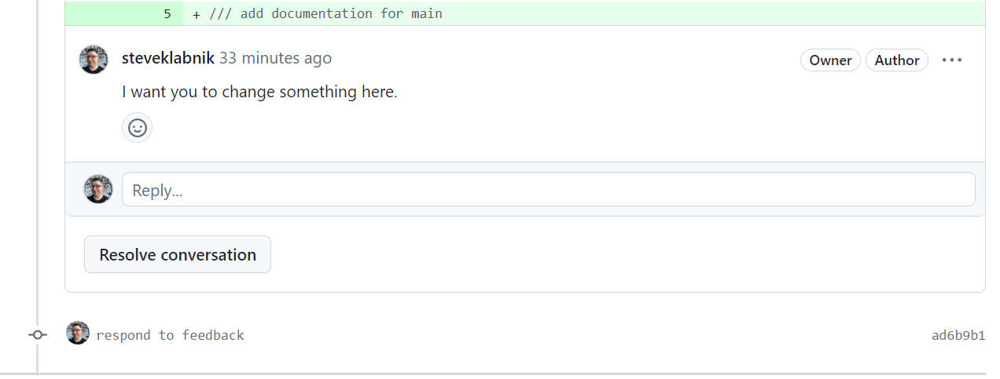
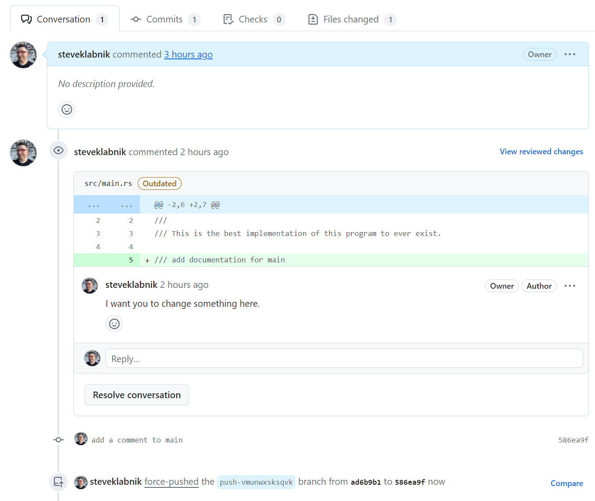

# Responding to pull request feedback

Oh no! Someone has asked for changes to our pull request.


We have two ways of making our change, and it depends on what the project's
maintainers prefer. Due to the way that GitHub shows or minimizes comments on
a pull request, some projects prefer that you never modify commits that you've
pushed to a pull request, and only want you to add commits to fix problems.
Other projects are okay with you modifying history, or even actively want one
commit per pull request. We can do both, but the way we do it looks a little bit
different.

## Adding commits to a PR

Adding commits to a PR is easy, but works *just* differently enough in `jj` that
it can be confusing at first. Let me explain.

Let's create a new change:

```console
$ jj new -m "respond to feedback"
Working copy now at: nzsvmmzl 3b663200 (empty) respond to feedback
Parent commit      : vmunwxsk 9410db49 push-vmunwxsksqvk | add a comment to main
```

And change the text of the comment in `src/main.rs`:

```rust
/// A "Hello, world!" program.
///
/// This is the best implementation of this program to ever exist.

/// The main function runs when our program starts
fn main() {
    print("Hello, world!");
}

// a function that prints a message
fn print(m: &str) {
    println!("{m}")
}
```

Our change is ready, but one thing is missing:

```console
$ jj log
@  nzsvmmzl steve@steveklabnik.com 2024-03-02 09:22:40.000 -06:00 ad6b9b14
│  respond to feedback
◉  vmunwxsk steve@steveklabnik.com 2024-03-02 08:27:30.000 -06:00 push-vmunwxsksqvk 9410db49
│  add a comment to main
◉  ksrmwuon steve@steveklabnik.com 2024-03-01 23:10:35.000 -06:00 trunk e202b67c
│  Update Cargo.toml
~
```

Remember, `jj new` won't move any branches, and so if we push, nothing happens:

```console
$ jj git push
Warning: No bookmarks found in the default push revset: remote_bookmarks(remote=origin)..@
Nothing changed.
```

First we have to update the branch to point at our new commit, and then push:

```console
$ jj bookmark set push-vmunwxsksqvk
Moved 1 bookmarks to nzsvmmzl ad6b9b14 push-vmunwxsksqvk* | respond to feedback
$ jj git push
Changes to push to origin:
  Move forward bookmark push-vmunwxsksqvk from 9410db49f9ba to ad6b9b149f88
```



Since we added a commit, the review comment is still there, which is why people
like this workflow.

Now, when people learn about this behavior for the first time, they're often a
little annoyed. It sounds like you have to do an extra step each time you change
your pull request. But I've found that in practice, this overhead affects small
PRs more than larger ones. The real mental change is to make sure that your branch
is pointing where you want it to just before you push, not after each commit.
In other words, the workflow is not:

1. Make change
2. Update branch
3. Make change
4. Update branch
5. Push

It is:

1. Make change
2. Make change
3. Update branch
4. Push

Since I am always looking things over before I push them up, I'm already going
to notice if my branch is out of date, and if you forget, the worst case is that
nothing gets pushed, which is a reminder to go and update the branch anyway.

The next workflow eliminates this extra "update the branch" step, but comes with
its own challenges. Let's look at rebasing pull requests instead of adding new
commits to them.

## Rebasing a PR

First, we have to undo what we just did. Here's where we are:

```console
> jj log
@  nzsvmmzl steve@steveklabnik.com 2024-03-02 09:22:40.000 -06:00 push-vmunwxsksqvk ad6b9b14
│  respond to feedback
◉  vmunwxsk steve@steveklabnik.com 2024-03-02 08:27:30.000 -06:00 9410db49
│  add a comment to main
◉  ksrmwuon steve@steveklabnik.com 2024-03-01 23:10:35.000 -06:00 trunk e202b67c
│  Update Cargo.toml
~
```

So let's move the branch backwards, then abandon our new change:

```console
$ jj bookmark set push-vmunwxsksqvk -r @- --allow-backwards
Moved 1 bookmarks to vmunwxsk 9410db49 push-vmunwxsksqvk* | add a comment to main
$ jj edit vmunwxsk
Working copy now at: vmunwxsk 9410db49 push-vmunwxsksqvk* | add a comment to main
Parent commit      : ksrmwuon e202b67c trunk | Update Cargo.toml
Added 0 files, modified 1 files, removed 0 files
$ jj abandon nzsvmmzl
Abandoned commit nzsvmmzl ad6b9b14 push-vmunwxsksqvk@origin | respond to feedback
$ jj log
@  vmunwxsk steve@steveklabnik.com 2024-03-02 08:27:30.000 -06:00 push-vmunwxsksqvk* 9410db49
│  add a comment to main
◉  ksrmwuon steve@steveklabnik.com 2024-03-01 23:10:35.000 -06:00 trunk e202b67c
│  Update Cargo.toml
~
```

Nice. We can see that the branch name has an asterisk by it now; because we are
tracking this branch to a remote, `jj` is noting that our understanding of this
branch and the remote's understanding are different.

Let's make it even more different: let's edit `src/main.rs` again:

```rust
/// A "Hello, world!" program.
///
/// This is the best implementation of this program to ever exist.

/// The main function runs when our program starts
fn main() {
    print("Hello, world!");
}

// a function that prints a message
fn print(m: &str) {
    println!("{m}")
}
```

Same as before. Since `jj` is tracking changes that we've made, our commit has
already been "rebased" in a sense. So we can just push:

```console
> jj git push
Changes to push to origin:
  Move sideways bookmark push-vmunwxsksqvk from ad6b9b149f88 to 586ea9fd213f
```

We can see that reflected on GitHub:



Only one commit, and it shows that our comment is on an outdated comment.

This is really "rewriting" more than "rebasing," but rebasing also involve
rewriting history and you may additionally want to rebase

## Rebasing with multiple changes

Sometimes you have pull requests with more than one commit, though. What if we
had more than one change we wanted to make? Let's undo our change. Because this
is so small, I'm going to do it by hand, changing `src/main.rs`:

```rust
/// A "Hello, world!" program.
///
/// This is the best implementation of this program to ever exist.

/// add documentation for main
fn main() {
    print("Hello, world!");
}

// a function that prints a message
fn print(m: &str) {
    println!("{m}")
}
```

Let's make a new commit for some other sort of change. First we need to `jj
new`:

```output
$  jj new -m "add a new function"
Working copy now at: msmntwvo baaa23e8 (empty) add a new function
Parent commit      : vmunwxsk 6da57c93 push-vmunwxsksqvk* | add a comment to main
```

And then add some new functionality:

```rust
/// A "Hello, world!" program.
///
/// This is the best implementation of this program to ever exist.

/// add documentation for main
fn main() {
    print("Hello, world!");
    print("Goodbye, world!");
}

// a function that prints a message
fn print(m: &str) {
    println!("{m}")
}
```

Let's update our branch and push:

```console
> jj bookmark set push-vmunwxsksqvk
Moved 1 bookmarks to msmntwvo 8f7dcd91 push-vmunwxsksqvk* | add a new function
> jj git push
Changes to push to origin:
  Move sideways bookmark push-vmunwxsksqvk from 586ea9fd213f to 8f7dcd91ecbf
```

We now have two changes again. So what happens when we address our review? Well,
since we're okay with rebasing, we can just edit that commit directly:

```console
$ jj edit vmunwxsk
Working copy now at: vmunwxsk 6da57c93 add a comment to main
Parent commit      : ksrmwuon e202b67c trunk | Update Cargo.toml
Added 0 files, modified 1 files, removed 0 files
```

and update `src/main.rs`:

```rust
/// A "Hello, world!" program.
///
/// This is the best implementation of this program to ever exist.

/// The main function runs when our program starts
fn main() {
    print("Hello, world!");
    print("Goodbye, world!");
}

// a function that prints a message
fn print(m: &str) {
    println!("{m}")
}
```

And check our work:

```console
$ jj st
 jj st
Rebased 1 descendant commits onto updated working copy
Working copy changes:
M src\main.rs
Working copy : vmunwxsk f6f7dce9 add a comment to main
Parent commit: ksrmwuon e202b67c trunk | Update Cargo.toml
```

There's that automatic rebase again! We don't need to do anything with our
"add a new function" change, as it isn't conflicted. So we can just go ahead and
push:

```console
$ jj log
◉  msmntwvo steve@steveklabnik.com 2024-03-02 11:47:08.000 -06:00 push-vmunwxsksqvk* 752534be
│  add a new function
@  vmunwxsk steve@steveklabnik.com 2024-03-02 11:47:08.000 -06:00 f6f7dce9
│  add a comment to main
◉  ksrmwuon steve@steveklabnik.com 2024-03-01 23:10:35.000 -06:00 trunk e202b67c
│  Update Cargo.toml
~
$ jj next --edit
Working copy now at: msmntwvo 752534be push-vmunwxsksqvk* | add a new function
Parent commit      : vmunwxsk f6f7dce9 add a comment to main
Added 0 files, modified 1 files, removed 0 files
$ jj git push
Changes to push to origin:
  Move sideways bookmark push-vmunwxsksqvk from 8f7dcd91ecbf to 752534beb39f
```

And now we're good! Just that easy. If we didn't want to move `@`, we could have
done `jj git push -b push-vmunwxsksqvk` to push that specific branch, but I
like not staying in the middle of a branch once I'm done with that work.

## Recap

We learned two different ways of handling pull request feedback: adding more
commits, and rewriting commits. While both of these ways work, they both have
different drawbacks. In the next chapter, we're going to explore some more
advanced ways of working that allow us to mitigate some of the drawbacks, as
well as talk about working with other tools that let us work with `jj` in
a nicer way.
